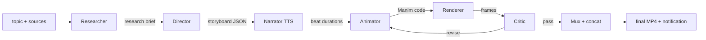

# teachme

Type a concept. Get a narrated, 3Blue1Brown-style explainer video, built
end to end by a pipeline of agents that write, render, watch, and revise
their own animations.

```bash
teachme generate "why correlation matrices need more data than variances"
teachme generate "equity factor risk models" --sources docs/METHODOLOGY.md
```

The pipeline runs unsupervised. When the video is ready, you get a
notification and an MP4.

**Hosted instance**: https://teach-me-production.up.railway.app — watch the
demo, sign in with Google, and generate your own explainer (bring your own
Anthropic API key, or use the site's key for one free trial).

## How it works



1. **Researcher** builds a research brief: the core tension, the
   step-by-step logic, real numbers, and common misconceptions. It treats
   your `--sources` files (docs, papers, a codebase) as ground truth and
   can do web research.
2. **Director** turns the brief into a storyboard: scenes, narration
   beats written for the ear, and a precise beat-by-beat visual spec.
3. **Narrator** synthesizes the narration first. The measured audio
   durations then drive the animation timing, so visuals stay in sync
   with the voice.
4. **Animator** writes Manim code for each scene against a strict style
   guide (color continuity, transforms over cuts, safe margins, one idea
   at a time).
5. **Renderer** renders the code. Render errors go back to the animator
   for fixes automatically.
6. **Critic** looks at sampled frames with vision and grades legibility,
   faithfulness to the spec, composition, pacing, and palette continuity.
   High-severity issues send the code back for revision. This loop is
   what separates the output from a one-shot GIF.
7. The scenes get muxed with narration and concatenated into one video.

Every intermediate artifact (brief, storyboard, each code version, each
critique, frames, per-scene videos) lands in the output directory, and
`--resume` restarts a run without repeating finished work.

## Plug and play

Every slot is swappable in a YAML config, by registered name or by a
`module.path:ClassName` dotted path to your own implementation:

| Slot | Protocol | Built-ins |
|---|---|---|
| LLM per role | `backends.base.LLMBackend` | `claude_cli` (no API key needed), `anthropic_api` |
| Renderer | `render.base.Renderer` | `manim` (Manim Community Edition) |
| Voice | `audio.base.TtsBackend` | `macos_say`, `openai_tts` |
| Notification | config | macOS banner, any shell command (email, Slack, ...) |

The contract between stages is small and typed (`types.py`): a
`Storyboard` of `SceneSpec`s with narration `Beat`s, and a `Critique`.
A renderer plug-in publishes a `code_contract` string that tells the
animator how to write code for it, so new renderers (Motion Canvas,
Remotion, p5.js) need no changes to the roles.

See `configs/default.yaml` for the reference instance: Claude Opus for
research and directing, Claude Sonnet for animation code and frame
critique, Manim for rendering, macOS `say` for the voice.

## Install

Requirements: Python 3.11+, ffmpeg, LaTeX (for equations; MacTeX or
TeX Live with `dvisvgm`), and the [Claude Code
CLI](https://claude.com/claude-code) for the default backend (or an
`ANTHROPIC_API_KEY` for the API backend).

```bash
git clone https://github.com/wanxinwanxin/teach-me
cd teach-me
python3 -m venv .venv
.venv/bin/pip install -e .
.venv/bin/teachme generate "your topic" --config configs/default.yaml
```

On macOS, Manim needs cairo and pango: `brew install cairo pango pkg-config`.

## Design notes

- **Why programmatic animation and not a video generation model?**
  3Blue1Brown's precision comes from code: every label, curve, and
  transform is deterministic. Generative video models garble text and
  drift between shots. So the LLM writes animation code, and the pixels
  stay exact. A video-model renderer can still plug in for texture shots.
- **Why narration-first timing?** Synthesizing the voice before the
  animation turns sync from a hard inference problem into arithmetic:
  the animator receives each beat's duration and a `BeatClock` helper
  pads the remainder.
- **Why a critic with vision?** One-shot generated animations fail on
  layout: overlaps, cutoffs, dead time. The generator cannot see its own
  output; the critic can. The loop typically converges in 1-2 rounds.

## Demo

Watch the first fully auto-generated explainer (10 minutes, six scenes,
zero human edits): [How an Equity Factor Risk Model Works](https://github.com/wanxinwanxin/teach-me/releases/download/v0.1.0/how-an-equity-factor-risk-model-works.mp4).

## Example

`examples/factor-risk-model/` builds an explainer of equity factor risk
models (factor exposures, cross-sectional regression, EWMA covariance
with split half-lives, Newey-West, volatility regime adjustment, specific
risk, and why optimized portfolios are the adversary), grounded in the
methodology docs of [risk-prism](https://github.com/wanxinwanxin/risk-prism):

```bash
.venv/bin/teachme generate \
  "how an equity factor risk model works" \
  --sources examples/factor-risk-model/sources \
  --clarify "Explain the concepts and their economic and mathematical intuition, not the source code." \
  --config configs/default.yaml \
  --out output/factor-risk-model
```

## License

MIT
